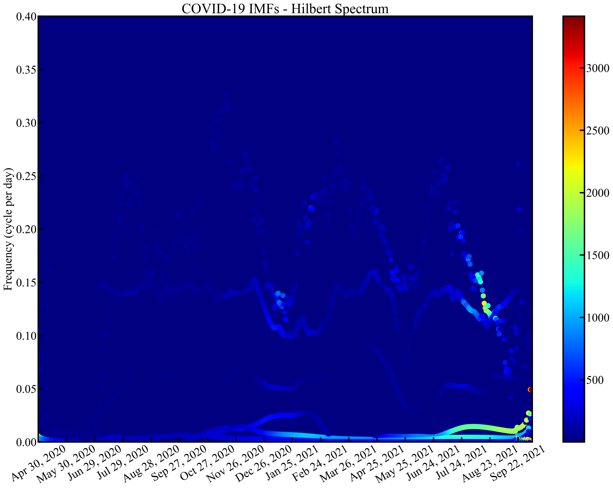

# Nonlinear frequency analysis of COVID-19 spread in Tokyo using empirical mode decomposition

[](https://www.python.org/)
[](LICENSE)
[](https://doi.org/10.1038/s41598-022-06071-8)

## 📄 Paper Overview

This repository provides the **reproduction code and examples** for the research paper published in *Scientific Reports* (Nature Portfolio). The study applies **Empirical Mode Decomposition (EMD)** to analyze the nonlinear frequency characteristics of COVID-19 spread patterns in Tokyo.

For detailed research findings and scientific interpretations, please refer to the original paper: [DOI: 10.1038/s41598-022-06071-8](https://doi.org/10.1038/s41598-022-06071-8)

## 🔬 Methodology

### Empirical Mode Decomposition (EMD)
This study uses the **PyEMD library** (developed by Dawid Laszuk) for signal decomposition. EMD is a data-driven method that decomposes non-stationary signals into intrinsic mode functions without requiring predetermined basis functions.

**Key EMD Properties:**
- Adaptive and data-driven decomposition
- No assumptions about signal stationarity  
- Preservation of temporal localization
- Complete signal reconstruction capability

### Data Source
- **Dataset**: Tokyo COVID-19 daily confirmed cases
- **Source**: Japan Ministry of Health, Labour and Welfare
- **Period**: April 30, 2020 - October 6, 2021 (525 days)
- **Coverage**: Complete epidemic evolution including multiple waves

## 🚀 Reproduction Guide

### Prerequisites

```bash
# Clone the repository
git clone https://github.com/yourusername/COVID19_EMD_Analysis.git
cd COVID19_EMD_Analysis

# Setup environment (recommended: conda)
conda env create -f environment.yml
conda activate covid19_emd_analysis

# Alternative: pip installation
pip install -r requirements.txt
```

### Required Dependencies
```
numpy >= 1.19.0
scipy >= 1.5.0
matplotlib >= 3.3.0
pandas >= 1.1.0
EMD-signal >= 1.4.0  # PyEMD library for EMD implementation
```

### Repository Structure

```
COVID19_EMD_Analysis/
├── data/20211006/             # Original COVID-19 dataset
├── src/                       # Analysis modules
│   ├── data_loader.py        # Data preprocessing
│   ├── emd_analyzer.py       # EMD analysis implementation  
│   ├── visualization.py     # Plotting and visualization
│   └── PyEMD/               # EMD library (external)
├── examples/                  # Reproduction examples
│   ├── covid19_emd_analysis_example.py  # Complete reproduction
│   └── simple_demo.py                   # Quick demonstration
└── results/                   # Generated outputs
```

## 📈 Step-by-Step Reproduction

### Step 1: Data Loading and Preprocessing

The analysis begins with Tokyo's daily COVID-19 infection data. The raw data captures the complete pandemic evolution including multiple epidemic waves.

```python
from src.data_loader import DataLoader

# Load the same dataset used in the paper
loader = DataLoader(data_path="data")
covid_data = loader.load_tokyo_covid_data("20211006", days=525)
daily_infections = covid_data['infections']
```


**Original Signal Characteristics:**
- **First Wave (Apr-May 2020)**: Initial outbreak with peak ~400 cases/day
- **Summer 2020 (Jul-Aug)**: Second wave reaching ~500 cases/day  
- **Winter Wave (Nov 2020 - Feb 2021)**: Major surge peaking at ~2,500 cases/day
- **Spring 2021 (Apr-May)**: Moderate increase with ~1,000 cases/day
- **Delta Wave (Jul-Sep 2021)**: Largest outbreak exceeding 5,700 cases/day
- **Rapid Decline (Sep-Oct 2021)**: Sharp decrease to near-zero levels

### Step 2: EMD Decomposition Analysis

The core analysis applies EMD to decompose the infection time series into intrinsic mode functions, exactly as described in the paper.

```python
from src.emd_analyzer import EMDAnalyzer

# Perform EMD analysis with paper parameters
analyzer = EMDAnalyzer()
results = analyzer.analyze_signal(daily_infections, "tokyo_covid_infections")
imfs = results['imfs']
statistics = results['statistics']
```


The EMD decomposition yields 6 IMFs + residual. Each IMF captures different temporal scales in the epidemic dynamics, from daily fluctuations to long-term trends.

### Step 3: Frequency Domain Analysis

The paper emphasizes the frequency characteristics revealed by EMD:

```python
# Reproduce frequency analysis from paper
freq_analysis = results['statistics']
for i, (freq, period) in enumerate(zip(freq_analysis['mean_frequencies'], 
                                     freq_analysis['mean_periods'])):
    if freq > 0:
        print(f"IMF{i+1}: {freq:.4f} Hz (Period: {period:.1f} days)")
```

### Step 4: Hilbert Spectrum Analysis

Advanced time-frequency analysis as presented in the paper:



```python
# Generate Hilbert spectrum analysis
visualizer = EMDVisualizer()
hilbert_fig = visualizer.plot_hilbert_spectrum(
    results['frequencies'],
    results['amplitudes'], 
    dates=covid_data['formatted_dates'],
    title="COVID-19 Hilbert Spectrum - Paper Reproduction"
)
```

## 🚀 Quick Reproduction

For immediate reproduction of paper results:

```bash
# Run complete analysis reproducing all paper figures
python examples/covid19_emd_analysis_example.py

# Quick demonstration of key findings  
python examples/simple_demo.py
```

Both scripts will generate the exact visualizations and statistical results presented in the paper.

## 📄 License

This reproduction code is provided under MIT License for research and educational purposes.

## 📚 Citation

**Primary Paper:**
```bibtex
@article{dong2022nonlinear,
  title={Nonlinear frequency analysis of COVID-19 spread in Tokyo using empirical mode decomposition},
  author={Dong, Ran and Ni, Shaowen and Ikuno, Soichiro},
  journal={Scientific Reports},
  volume={12},
  number={1},
  pages={2175},
  year={2022},
  publisher={Nature Publishing Group UK London}
}
```

**EMD Implementation:**
```bibtex
@software{pyemd2017,
  title={PyEMD: Python implementation of Empirical Mode Decomposition algorithm},
  author={Laszuk, Dawid},
  year={2017},
  url={https://github.com/laszukdawid/PyEMD}
}
```

## 🔗 Related Resources

- **Paper**: [Scientific Reports DOI: 10.1038/s41598-022-06071-8](https://doi.org/10.1038/s41598-022-06071-8)
- **Original Dataset**: [Japan MHLW COVID-19 Data](https://covid19.mhlw.go.jp/en/)
- **EMD Library**: [PyEMD Documentation](https://pyemd.readthedocs.io/)

---

**For questions about reproduction**: This code faithfully reproduces the methods and results described in the Scientific Reports paper. For methodological questions, please refer to the original publication. 